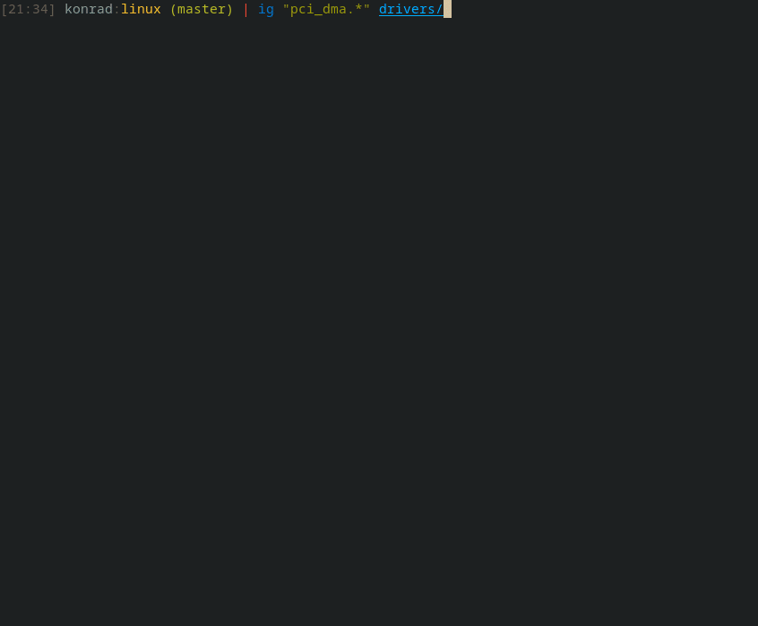

# igrep - Interactive Grep
Runs [grep](https://crates.io/crates/grep) ([ripgrep's](https://github.com/BurntSushi/ripgrep/) library) in the background, allows interactively pick its results and open selected match in text editor of choice (vim by default).

`igrep` supports macOS and Linux. Windows support will be considered.



## Usage
`ig [OPTIONS] <PATTERN|--type-list> [PATH]`

### Args
```
<PATTERN>    Regular expression used for searching.
<PATH>       File or directory to search. Directories are searched recursively.
             If not specified, searching starts from current directory.
```

### Options
```
-., --hidden                  Search hidden files and directories. By default, hidden files and
                              directories are skipped.
    --editor <EDITOR>         Text editor used to open selected match [possible values: vim,
                              neovim, nvim, nano]
-g, --glob <GLOB>             Include files and directories for searching that match the given glob.
                              Multiple globs may be provided.
-h, --help                    Print help information
-i, --ignore-case             Searches case insensitively.
-S, --smart-case              Searches case insensitively if the pattern is all lowercase.
                              Search case sensitively otherwise.
-t, --type <TYPE_MATCHING>    Only search files matching TYPE.
                              Multiple types may be provided.
-T, --type-not <TYPE_NOT>     Do not search files matching TYPE-NOT.
                              Multiple types-not may be provided.
    --type-list               Show all supported file types and their corresponding globs.
-V, --version                 Print version information.
```

### Keybindings
| Key                                            | Action                                         |
|------------------------------------------------|------------------------------------------------|
| `q`, `Esc`                                     | Quit                                           |
| `Down`, `j`                                    | Select next match                              |
| `Up`,`k`                                       | Select previous match                          |
| `Right`, `l`, `PageDown`                       | Select match in next file                      |
| `Left`, `h`, `PageUp`                          | Select match in previous file                  |
| `gg`, `Home`                                   | Jump to the first match                        |
| `Shift-g`, `End`                               | Jump to the last match                         |
| `Enter`                                        | Open current file                              |
| `dd`, `Delete`                                 | Filter out selected match                      |
| `dw`                                           | Filter out all matches in current file         |
| `F5`                                           | Re-run search                                  |

### Specifying text editor
`igrep` supports vim, neovim/nvim and nano.
To specify the editor, use one of the following (listed in order of their precedence): 
- `--editor` option,
- `$IGREP_EDITOR` variable,
- `$EDITOR` variable.

Higher priority option overrides lower one. If neither of these options is set, vim is used as a default.

### Installation
`igrep` binaries can be download from [GitHub](https://github.com/konradsz/igrep/releases) (for Linux and MacOS). One can also build and install it from source using Rust toolchain by running: `cargo install igrep`.