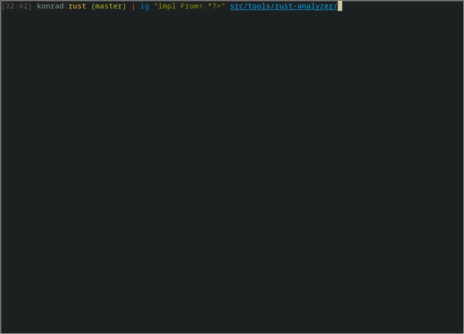

# igrep - Interactive Grep
Runs [grep](https://crates.io/crates/grep) ([ripgrep's](https://github.com/BurntSushi/ripgrep/) library) in the background, allows interactively pick its results and open selected match in text editor of choice (vim by default).

`igrep` supports macOS and Linux. Reportedly it works on Windows as well.



## Usage
`ig [OPTIONS] <PATTERN|--type-list> [PATHS]...`

### Args
```
<PATTERN>    Regular expression used for searching.
<PATHS>...   Files or directories to search. Directories are searched recursively.
             If not specified, searching starts from current directory.
```

### Options
```
-., --hidden                    Search hidden files and directories. By default, hidden files and
                                directories are skipped.
    --editor <EDITOR>           Text editor used to open selected match.
                                [possible values: check supported text editors section]
    --context-viewer <VIEWER>   Context viewer position at startup [default: none]
                                [possible values: none, vertical, horizontal]
    --custom-command <COMMAND>  Custom command used to open selected match.
                                Must contain {file_name} and {line_number} tokens (check Custom Command section).
-g, --glob <GLOB>               Include files and directories for searching that match the given glob.
                                Multiple globs may be provided.
-h, --help                      Print help information
-i, --ignore-case               Searches case insensitively.
-L, --follow                    Follow symbolic links while traversing directories
-S, --smart-case                Searches case insensitively if the pattern is all lowercase.
                                Search case sensitively otherwise.
-t, --type <TYPE_MATCHING>      Only search files matching TYPE.
                                Multiple types may be provided.
-T, --type-not <TYPE_NOT>       Do not search files matching TYPE-NOT.
                                Multiple types-not may be provided.
    --theme <THEME>             UI color theme [default: dark] [possible values: light, dark]
    --type-list                 Show all supported file types and their corresponding globs.
-V, --version                   Print version information.
-w, --word-regexp               Only show matches surrounded by word boundaries
```
NOTE: `ig` respects `ripgrep`'s [configuration file](https://github.com/BurntSushi/ripgrep/blob/master/GUIDE.md#configuration-file) if `RIPGREP_CONFIG_PATH` environment variable is set and reads all supported options from it.

## Keybindings
<!-- The markers above and below the table are required for build script -->
<!-- keybindings start -->
| Key                      | Action                                 |
| ------------------------ | -------------------------------------- |
| `q`, `Esc`, `Ctrl+c`     | Quit                                   |
|                          |                                        |
| `?`, `F1`                | Open/close the keymap popup            |
| `Down`, `j`              | Scroll down in the keymap popup        |
| `Up`, `k`                | Scroll up in the keymap popup          |
| `Right`, `l`             | Scroll right in the keymap popup       |
| `Left`, `h`              | Scroll left in the keymap popup        |
|                          |                                        |
| `Down`, `j`              | Select next match                      |
| `Up`,`k`                 | Select previous match                  |
| `Right`, `l`, `PageDown` | Select match in next file              |
| `Left`, `h`, `PageUp`    | Select match in previous file          |
| `gg`, `Home`             | Jump to the first match                |
| `Shift-g`, `End`         | Jump to the last match                 |
| `Enter`                  | Open current file                      |
| `dd`, `Delete`           | Filter out selected match              |
| `dw`                     | Filter out all matches in current file |
| `v`                      | Toggle vertical context viewer         |
| `s`                      | Toggle horizontal context viewer       |
| `+`                      | Increase context viewer size           |
| `-`                      | Decrease context viewer size           |
| `F5`                     | Open search pattern popup              |
<!-- keybindings end -->

## Supported text editors
`igrep` supports Vim, Neovim, nano, VS Code (stable and insiders), Emacs, EmacsClient, Helix, SublimeText, Micro, Intellij, Goland, Pycharm and Less. If your beloved editor is missing on this list and you still want to use `igrep` please file an issue or use [custom command](#custom-command).

## Specifying text editor
### Builtin editors
To specify builtin editor, use one of the following (listed in order of their precedence):
- `--editor` option,
- `$IGREP_EDITOR` variable,
- `$VISUAL` variable,
- `$EDITOR` variable.

Higher priority option overrides lower one. If neither of these options is set, vim is used as a default.

### Custom Command
Users can provide their own command used to open selected match using `--custom-command` option. It must contain {file_name} and {line_number} tokens. Example command used to open file in Vim looks as follows:

`--custom-command "vim +{line_number} {file_name}"`

The same argument can also be passed via the `$IGREP_CUSTOM_EDITOR` environment variable. Example:

`IGREP_CUSTOM_EDITOR="vim +{line_number} {file_name}"`

## Installation
### Prebuilt binaries
`igrep` binaries can be downloaded from [GitHub](https://github.com/konradsz/igrep/releases).
### Homebrew
```
brew tap konradsz/igrep https://github.com/konradsz/igrep.git
brew install igrep
```
### Scoop
```
scoop install igrep
```
### Arch Linux
```
pacman -S igrep
```
### Alpine Linux

`igrep` is available for [Alpine Edge](https://pkgs.alpinelinux.org/packages?name=igrep&branch=edge). It can be installed via [apk](https://wiki.alpinelinux.org/wiki/Alpine_Package_Keeper) after enabling the [testing repository](https://wiki.alpinelinux.org/wiki/Repositories).

```
apk add igrep
```

### Build from source
Build and install from source using Rust toolchain by running: `cargo install igrep`.
